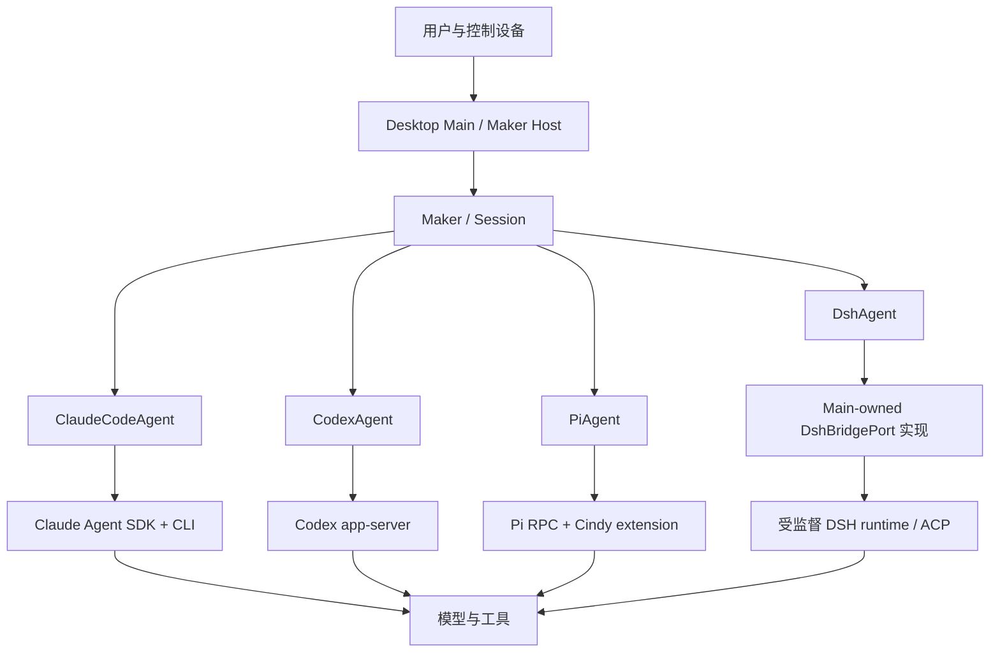
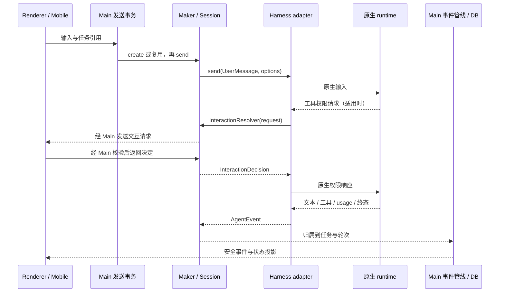

# Cindy 接入多 Agent Harness 的原理

> 阅读顺序：**本篇：原理** → [架构全貌](architecture.md) → [技术方案与接入指南](multi-agent-harness-integration.md)。
> 核对日期：2026-09-16；源码基线：`773672742c48f8195c21acba16efb8ae52879c49`，分支 `codex/dsh-runtime-main-20260915`，含当时工作树的 DSH 未提交改动。
> 本篇解释当前客户端设计与实现，不代表已安装 App、真实模型服务或跨端运行已通过验收。专项工程规则仍是维护合同的正本。

## 目录

- [1. Cindy 连接的究竟是什么](#p1)
- [2. 系统为什么需要两层运行时](#p2)
- [3. 一套公共接口怎样承接不同 harness](#p3)
- [4. 一次用户请求的完整往返](#p4)
- [5. 工具、MCP、Skill 和插件如何接上](#p5)
- [6. 模型路由和 harness 不是同一个维度](#p6)
- [7. 状态、历史、上下文和记忆](#p7)
- [8. 三种不同的多 Agent 机制](#p8)
- [9. 多端、权限与故障恢复](#p9)
- [10. 设计收益、成本与阅读索引](#p10)

<a id="p1"></a>
## 1. Cindy 连接的究竟是什么

Cindy 是 Agent 的执行宿主和工作界面。它把用户输入、工作目录、模型连接、工具、任务历史、权限和设备连接起来；推理与工具交替执行的原生循环主要由 Claude Code、Codex、Pi、DSH 等 harness 承担。Cindy 因此能够在同一产品里承载不同执行引擎，而不必为每种引擎重做任务列表、消息区、文件浏览和远程控制。

这符合仓库的[核心产品原则](product-rules/core-product-principles.md)：连接并保留底层能力。不能由此推导出“Cindy 只是 UI”；Cindy 还拥有真实的宿主控制、事件处理、数据持久化和协作编排职责。

| 名词 | 本文含义 | 对应例子或边界 |
|---|---|---|
| 模型 | 接收上下文并生成文字、推理或工具调用的推理服务 | 某个具体模型 ID；自身不等于任务系统 |
| 供应商／连接 | 模型访问来源及其账号、凭证、地址、目录与协议 | 同一模型可以经多个连接调用 |
| Harness／执行引擎 | 包含模型调用、工具执行、上下文治理、原生历史等能力的 Agent 运行框架 | Claude Code、Codex、Pi、DeepSeek Harness |
| Agent adapter | Cindy 对某一 harness 的适配对象 | `ClaudeCodeAgent`、`CodexAgent`、`PiAgent`、`DshAgent` |
| Cindy 任务 | 产品中可命名、归档、打开并持续交流的对象；代码称 `Session` | 一个稳定的业务 `sessionId`，不等于一个进程 |
| 原生 session/thread | harness 自己管理的执行历史与运行身份 | Claude session、Codex thread、Pi session 文件、DSH native session |
| Turn | 一轮已分发输入及其生成、工具执行和终态 | `done` 通常结束一轮，不表示整个 Cindy 任务被关闭 |
| Tool | 可执行的一个动作，具有输入和结果 | 读文件、执行命令、调用业务 API |
| MCP | 暴露和调用工具的协议与接入方式 | 并非所有原生工具都经过 MCP |
| Skill | 可复用的工作方法和相关资源 | 指令文件、脚本、模板；不会自行变成宿主权限 |
| Cindy 插件 | 经 Host 管理的 `.cindy` 沙箱应用及结构化能力 | 与 Pi 原生 extension/package 是两套机制 |
| Bot／伙伴 | 长期身份、主任务、记忆、模型候选链与能力配置 | 使用 harness 执行，但身份不归 harness 所有 |
| 协作编排 | 多个执行单元之间的派活、回传、生命周期和归属管理 | Orca Lead/Worker；不同于模型的普通工具调用 |

技术名 `Session` 保留；面向用户称“任务”，“对话”指任务内的交流与内容，“消息”指单条往来。原生后台 `task` 与 Cindy 任务同句出现时写成“后台执行单元”。命名依据见[任务与对话命名](product-rules/task-and-conversation-naming.md)。

<a id="p2"></a>
## 2. 系统为什么需要两层运行时

第一层是 **Cindy 产品运行时**：确定当前账号、任务、工作目录、输入队列、可用能力、持久化与控制设备。第二层是 **harness 原生运行时**：持有原生上下文和工具循环。产品任务可以在原生进程关闭后保留，也可以在必要时换一个原生上下文继续。



图中 DSH 的箭头表示注入接口调用：`maker-core` 依赖桥接契约，**不 import Desktop Main**。桥接实例由 Main 创建并注入，进程、凭证、原生身份和原始 ACP 留在 Main 控制面。

| 职责 | 主要所有者 | Cindy 的适配责任 |
|---|---|---|
| 模型推理与原生 Agent loop | harness／模型 | 准备路由和输入，忠实传递事件，不在 Renderer 重造循环 |
| 原生工具与内部子 Agent | harness | 接入权限、状态显示和必要桥接；不把原生子 Agent 自动升级为 Orca Worker |
| 业务任务与用户时间线 | Cindy Main、DB、Maker | 稳定 ID、消息、归档、跨入口调度、恢复关联 |
| 原生历史与上下文窗口 | harness | 保存恢复引用；控制压缩失败后的有界交接，保留产品历史 |
| 凭证与运行环境 | Host；经授权注入原生进程 | 账号隔离、路径装配、生命周期和清理 |
| 工具权限 | 原生机制与 Cindy Host/扩展的组合 | 每家机制不同；UI 确认只能代表已经接通的执行约束 |
| 模型选择与目录 | Cindy 模型资料和连接层，加原生参数 | 目录、账号准入、执行协议分别判断 |
| 多端控制 | device-link 与目标 Desktop | 请求路由和状态投影；执行真相仍在目标设备 |

源码入口：[Maker Host](../apps/desktop/src/main/maker-host/index.ts)、[Maker](../packages/maker-core/src/maker.ts)、[Session](../packages/maker-core/src/session.ts)、[DSH adapter](../packages/maker-core/src/agents/dsh/index.ts)。

<a id="p3"></a>
## 3. 一套公共接口怎样承接不同 harness

### 3.1 依赖注入把平台能力与适配器分开

Host 先准备可执行文件、认证、日志、模型路由、存储和 MCP，再创建 adapter 并交给 `Maker`。`AgentDeps` 是注入合同；`BaseAgent` 构造时要求非空 `binaryPath`，不会自行联网下载 runtime。`SessionStorage` 由 Desktop 对接 DB，而不是由 adapter import SQLite 或 Electron。

这种边界允许相同核心通过不同 transport 驱动本地或远端执行，也允许测试替换存储和协议端点。[公共基类](../packages/maker-core/src/agents/base-agent.ts)和[宿主接口](../packages/maker-core/src/interfaces/index.ts)是事实来源。当前 `AgentDeps` 同时包含通用与厂商专属 hook，并不是一个已经完全对称的插件 ABI。

### 3.2 公共句柄统一操作，能力声明保留差异

`BaseAgent.startSession()` 返回 `AgentSessionHandle`。必选操作包括 `send`、`steer`、`abort`、`close`、`events`、`getUsageSnapshot` 和 `setInteractionResolver`；模型调整、树导航、导出等存在可选方法。方法在接口中出现，不代表每个引擎的产品入口都可用；不支持的必选操作也需要明确拒绝。

能力使用 [Capabilities](../packages/maker-core/src/types/capabilities.ts) 描述：

```ts
type CapabilityStatus =
  | { supported: true }
  | {
      supported: false;
      reason: 'sdk-missing' | 'not-implemented' | 'platform-limited';
      upstreamRef?: string;
      message?: string;
    };
```

“上游没有”“Cindy 尚未接入”“当前平台受限”必须分开。另一个独立问题是注册与运行准入：`AgentKind` 已认识 `dsh`，不表示本机已注册 DSH，也不表示某个账号或 endpoint 已验证可用。

### 3.3 统一事件语义，不伪造原生能力

适配层把原生事件转换成 `text`、`thinking`、`tool_use`、`tool_result`、`interaction_request`、`status`、`done`、`error` 等 [AgentEvent](../packages/maker-core/src/types/events.ts)。各 adapter 通过异步队列输出，`Session` 处理轮次、来源、交互等待与活性，再由 Main 落库和广播。

当前 `AgentEvent` 的外层为 `type` 加 `data: unknown`，各事件另有结构和解析函数，并非每一种 payload 都被一个完备的 TypeScript 判别联合强制校验。translator、IPC 和共享投影的运行期验证因此仍然重要。

统一不能抹掉工具 ID、增量与全文、后台事件归属或终态差异。未知诊断事件可能仅记录日志，Codex 也显式选择订阅事件；“忠实映射”不等于把所有 vendor 原始包无条件广播给 UI。DSH 还要先由 Main 校验并提交投影日志，adapter 才能消费已提交的安全事件。

### 3.4 四种接入路径的本质区别

| Harness | 执行与通信 | 公共层以下的关键差异 |
|---|---|---|
| Claude Code | Agent SDK 包装 CLI；异步输入与 SDK 消息流 | SDK Query、`canUseTool`、原生 session/消息 UUID、checkpoint 与 resume |
| Codex | `app-server` 请求／响应和通知，JSON-RPC transport | host 可复用并按 thread 分流；路由和认证条件也会产生隔离 host，不能理解为全应用永远一个进程 |
| Pi | `pi --mode rpc`，JSONL/stdio；远端可替换 transport | 原生 extension 桥承接权限、MCP、运行命令；保留原生资源加载和上下文治理 |
| DSH | adapter → Main bridge → 受监督 Helper/runtime → ACP | Main 拥有 binding、receipt、projection、scope 与配置；adapter 只拿不透明引用 |

四条路径的源码、协议和版本清单见[技术方案第 3–6 节](multi-agent-harness-integration.md#i3)。

<a id="p4"></a>
## 4. 一次用户请求的完整往返

以本地任务中“读取项目文件并修改一处内容”为例：

1. Renderer 提交文字、附件引用、目标任务和选定参数，经固定 preload API 进入 Main。手机则先经 device-link 到执行 Desktop。
2. Main 检查输入、来源、账号和任务代次，协调队列及任务锁；首次发送可以触发 lazy-create，旧任务可以触发 rehydrate。
3. 发送事务应用最终选择的运行配置，装配路径、目录授权和上下文；`Maker` 复用同一 ID 的 live Session 或 singleflight 创建它。
4. adapter 建立原生句柄，`Session` 安装 interaction resolver 并消费事件流；输入通过 provider 接受边界分发。IPC 收到回执和任务执行完成是两个时刻。
5. harness 调用模型；模型提出读文件或写文件工具调用，交给原生工具或 MCP 执行。
6. 若命中已接通的权限检查，adapter 把请求交给统一 resolver；Main 决策或等待用户，随后转换回原生协议。点击允许不是由 UI 自己执行文件操作。
7. 原生文本、工具结果和用量经 translator 返回；Main 事件管线按对应轮次更新持久化和通知，Renderer store 投影成消息、卡片与状态。
8. 权威终态结算本轮并解除相应运行标记；原生后台执行单元可能另有 continuation，任务和进程不会因一条 `done` 就全部消失。



DSH 的原始事件先在 Main 控制面提交，再进入上述公共事件链；不能把本图理解为所有 harness 都在 adapter 内处理原始协议。核对入口：[发送事务](../apps/desktop/src/main/maker-ipc/makerSendTransaction.ts)、[事件管线](../apps/desktop/src/main/maker-ipc/sessionEventPipeline.ts)、[UI store](../apps/desktop/src/renderer/lib/makerChatStore.ts)。

<a id="p5"></a>
## 5. 工具、MCP、Skill 和插件如何接上

原生工具由 harness 执行；Cindy 工具经宿主 MCP provider 或专属桥注入。两者最终都可能产生工具卡片，但工具卡片是一种展示，不是权限和执行协议。

| 接入对象 | 装配路径 | 需要保留的差异 |
|---|---|---|
| Claude MCP | `McpProvider.toClaudeSdkConfig(context)` | SDK 配置可包含进程内 server；按任务上下文生成 |
| Codex MCP | `toCodexMcpConfig(context)` 与 HTTP bridge | 工具 handler 恢复 thread/session 身份；MCP transport ID 不是任务 ID |
| Pi MCP | `piEnvironment` + `cindy-bridge` | 当前模型侧使用稳定的 `cindy_mcp_list_tools` / `cindy_mcp_call_tool` 网关，先发现单工具 schema；权限仍针对真实工具 |
| DSH MCP | Main-owned、经授权的 bridge/lease | 存在本机内部 MCP 证据；不代表通用设置、所有外部 MCP 或跨端能力全部开放 |
| Skill | SkillHub 管理和各 harness 原生发现／装配 | Claude、Codex、Pi 的目录、命令、资源协议不同；DSH 不能直接套用前三者 |
| Cindy 插件 | Ghost 发现／调用工具 → Host slot → 沙箱插件 | 插件权限和资源交接独立；不是给插件完整 Main API |

依据：[McpProvider](../packages/maker-core/src/interfaces/mcp-provider.ts)、[Pi 环境](../apps/desktop/src/main/mcp-integrations/piEnvironment.ts)、[插件发现链](ghost-progressive-discovery.md)、[DSH 内部 MCP lease](../apps/desktop/src/main/dsh-host/internal-mcp-lease.ts)。

Prompt 装配也有差异。Claude 使用 SDK preset 与追加段；Pi 使用 `--append-system-prompt` 保留原生 prompt；Codex 在原生 thread/指令和 host 配置间适配；DSH 的 profile 与能力交接由 Main 控制。稳定前缀、工具顺序和启动快照影响缓存与行为，不能为统一格式随意重写。具体约束见 [Maker Core 行为规则](dev-rules/maker-core-and-agent-behavior.md)。

<a id="p6"></a>
## 6. 模型路由和 harness 不是同一个维度

通常一次调用需同时确定“哪个 harness”“哪个连接”“哪个模型”。连接层负责地址、认证、协议和目录；harness 层负责如何把任务交给原生 Agent。通过协议桥让 Claude Code 使用兼容的其他模型，并不会把这个任务变成 Codex 任务。

```text
运行选择 = harness + provider/connection + model + 当前支持的运行参数
模型链路 = 活动目录 → route resolver → 原生接口或 loopback proxy/bridge → 模型服务
任务链路 = Cindy Session → adapter → 原生 session/thread
```

模型资料的默认、供应商实报和用户 override 与账号准入是不同问题。目录显示一个模型不等于有凭证，也不等于该 harness 已实现其协议。Mobile 应读执行端目录。详见[模型维护入口](dev-rules/model-catalog-maintenance.md)。

| 操作 | 可能改变什么 | 当前约束 |
|---|---|---|
| 同 harness 切模型 | model、effort、窗口预算，必要时重建原生句柄 | 本地普通任务通常先登记意图，在下次发送时应用；小窗口需评估上下文 |
| 换供应商／账号 | 凭证、路由、协议桥，可能需要隔离 host | 原生历史位置不等于本轮认证来源；不能恢复到错误账号 |
| 切 harness | 原生执行器、工具环境、历史格式 | 三引擎普通本地任务通过交接与停泊绑定衔接，不是让另一个 harness 读取原始历史文件 |
| DSH 配置 | Main 管理的独立 runtime provider | `runtimes.dsh` 并非通用模型目录；当前不加入三引擎自由切换 |

实际跨引擎选择由[切换 handler](../apps/desktop/src/main/maker-ipc/sessionAgentSwitchHandler.ts)与[运行选择入口](../apps/desktop/src/main/maker-ipc/sessionRuntimeHarnessSelection.ts)处理。现有路径支持 Claude Code／Codex／Pi，排除 SSH 和 Orca 等不支持场景；切回已有停泊身份可用增量交接，否则创建新原生上下文并注入完整的有界交接。DSH 的 `cindy-dsh-managed` 是兼容字段中的 runtime 标识，不能当作真实模型 ID。

<a id="p7"></a>
## 7. 状态、历史、上下文和记忆

### 7.1 五份数据不能混为一谈

| 数据 | 内容 | 所有者 |
|---|---|---|
| 产品历史 | 用户消息、助手内容、工具投影、任务元数据 | Cindy DB／持久化服务 |
| 原生历史 | 原生消息 ID、rollout/session 文件、分支和执行状态 | harness；Cindy 保存恢复引用或受控 binding |
| 模型工作上下文 | 当前送入模型的系统段、摘要、近期消息、工具描述 | harness 与 Host 装配共同决定，受窗口限制 |
| 长期记忆 | 从项目、用户、Bot 或原生机制保存并召回的知识 | 各自的 scope 与存储；不能混用账号、Bot 和项目 |
| UI 投影 | 可见消息、运行指示、队列、交互卡和 usage | Renderer／Mobile 缓存，可从执行端补齐 |

打开任务能看到旧消息，只证明产品历史可读；恢复执行还需可用的原生历史、正确工作目录、账号、runtime 与能力。UI 显示“已归档”和原生进程“已关闭”也不等价：DB 产品状态与 `SessionStatus` 是两套枚举。

### 7.2 压缩和恢复由有证据的边界触发

优先保留原生压缩：Claude 的 SDK/Host 配合、Codex 的原生压缩路径、Pi 的原生 threshold/overflow compact，各有协议与时机。Cindy 的有界交接在终态超限或明确失败分类后介入；不能把每次超时都解释为上下文已满。

跨引擎交接与部分同引擎重建使用[确定性 handoff](../apps/desktop/src/main/maker-ipc/agentHandoff.ts)：近期详细内容、早期提要、工作状态和有界历史检索指引；用户展示正文与实际发送前缀分开。它不承诺完整迁移旧 harness 内部思考、私有工具状态或所有后台 continuation。

恢复必须区分输入未被接受、已接受但未完成、已有工具副作用、原生状态未知。已有副作用时重发原始请求可能重复执行；继续指令、重建和重放是三个动作，必须遵守各错误分类与原生证据。DSH 通过 durable prompt receipt 和 projection journal 管理这类不确定性，不把断线直接变成再次发送。

<a id="p8"></a>
## 8. 三种不同的多 Agent 机制

| 层次 | 谁创建与管理 | 执行对象 | 结果如何回来 |
|---|---|---|---|
| 多 harness 并存 | Maker 注册多个 adapter | 用户创建不同引擎的 Cindy 任务 | 公共 Session／AgentEvent／UI |
| 原生子 Agent | harness 原生能力或已接入的扩展 | 原生子线程、后台执行单元 | 原生事件，经 adapter 做子 Agent 观察与状态投影 |
| Orca 协作 | Cindy Main Orca service，Lead 经 MCP/UI 派活 | 独立完整 Worker Session | 队列、inter-agent dispatch、手动回传或 auto-bridge |

Orca 的 Lead 和 Worker 可以使用不同的已支持 harness，但它们共享 Cindy 业务协议，而非共享内存或模型上下文。Worker 有自己的模型、工具、历史和权限配置；不是把 Lead 的权限字段机械复制过去。工作目录是否隔离取决于实际 worktree/创建策略，独立 Session 本身不保证文件隔离。

`orca_role` 表达协作角色；`parent_session_id` / fork 锚点表达分叉来源。DSH activity 又是单独的 `cindy-dsh` 投影，不能由“看到多个 activity”推断已接入 Orca。

当前 Orca 支持 Claude Code、Codex、Pi；DSH Worker 明确被拒绝。SSH 的三引擎协作要求远端 runtime 和 MCP bridge 就绪；device-link 场景的 team 仍在被控 Desktop 上运行。依据：[Orca 规则](dev-rules/orca-team-architecture.md)、[Worker 创建服务](../apps/desktop/src/main/maker-ipc/orcaWorkerCreationService.ts)、[DSH activity](../packages/maker-core/src/agents/dsh/activity.ts)。

<a id="p9"></a>
## 9. 多端、权限与故障恢复

### 9.1 三种拓扑

本地 Desktop 直接承载原生 runtime；SSH 让 runtime 和项目位于远端主机，本地负责控制与桥接；device-link 让另一个 Desktop 或 Mobile 控制执行 Desktop。device-link 不是 SSH daemon，也不是把模型执行迁到手机。

只有同时满足身份、allowlist、handler、能力与 UI 投影的链路才可远控。DSH 已有共享身份和本地入口，不代表本机 Helper 管理、Home 选择或所有 activity 操作可直接隧道化。跨端表面与未实现项见[技术方案能力矩阵](multi-agent-harness-integration.md#i7)。

### 9.2 权限要落到实际执行点

- Claude 使用 SDK permission callback 和原生权限机制；Codex 使用 app-server approvals 与权限配置。
- Pi 通过 `tool_call` 扩展、权限文件与 Host resolver 接入审批；Full Access 遵循原生能力，当前不能宣称有 OS 沙箱隔离。
- DSH 使用 Main 对 ACP 请求的关联、一次性响应及受监督 runtime 边界；`allow-once` 不得扩展成永久授权。
- Cindy 插件还要经过 manifest slot、Host 身份和资源交接校验。工具可见、用户选择权限档和插件安装批准分别有自己的语义。

所以能力统一应统一用户能理解的操作，同时如实说明底层限制。不能为了“更统一”使原生允许的 Pi 安装/扩展失效，也不能用 UI 开关声称一个原生没有的隔离保证。规则见[Pi harness](dev-rules/pi-harness.md)与[Electron 边界](dev-rules/electron-security-and-process-boundaries.md)。

### 9.3 故障动作应与失败范围一致

一个 turn 失败不应关闭所有任务；一个 Codex thread 关闭不应杀掉同 host 的其他 thread；一个手机 link 超时不应重连整条 relay。账号切换和应用退出则是更高层生命周期，需等待相应创建、发送和清理收敛。

Maker 对同一任务创建去重，并保留未清理成功的旧 handle，避免旧进程未确认结束就发布替代实例。DSH 对不确定 runtime 状态进入 reconcile 边界，而不是猜测成功。共同目标是防止串任务、串账号、事件错归属和副作用重放。

<a id="p10"></a>
## 10. 设计收益、成本与阅读索引

收益是 UI 与数据能力复用、执行引擎可演进、跨端控制统一、原生能力保留。成本是 adapter 并不对称：协议、权限、历史、版本、后台执行和模型目录都需要持续维护。增加一个 `AgentKind` 只完成身份的一小部分，完整接入必须打通准入、执行、交互、持久化、恢复和产品入口。

| 下一步想了解 | 入口 |
|---|---|
| 所有模块与执行位置 | [架构全貌](architecture.md) |
| 四条实现和新增 harness 步骤 | [技术方案](multi-agent-harness-integration.md) |
| 公共契约与生命周期 | [BaseAgent](../packages/maker-core/src/agents/base-agent.ts)、[Maker](../packages/maker-core/src/maker.ts)、[Session](../packages/maker-core/src/session.ts) |
| 事件与能力结构 | [events](../packages/maker-core/src/types/events.ts)、[capabilities](../packages/maker-core/src/types/capabilities.ts) |
| DSH 当前裁决与历史方案冲突 | [DSH 施工正本](dev-rules/dsh-harness.md)，先读开头更新及 §0.2，不能沿用已被替代的 Native Host Gate |
| 用户身份长期运行 | [伙伴运行时](product-rules/cindy-bots-runtime.md) |
| 模型与协议路由 | [模型目录维护](dev-rules/model-catalog-maintenance.md) |
| 远端与移动端约束 | [远程适配](dev-rules/remote-and-mobile-adaptation.md)、[协议兼容](dev-rules/protocol-compatibility.md) |

本篇中的“已接入”描述源码能力，不证明每种运行组合均可用。真实模型、已安装包、授权工作目录、断线恢复、远端和设备验收需要相应运行证据，详见技术方案的验证章节。
